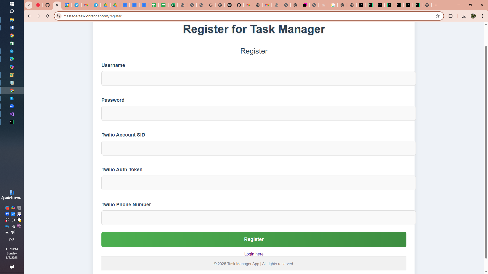
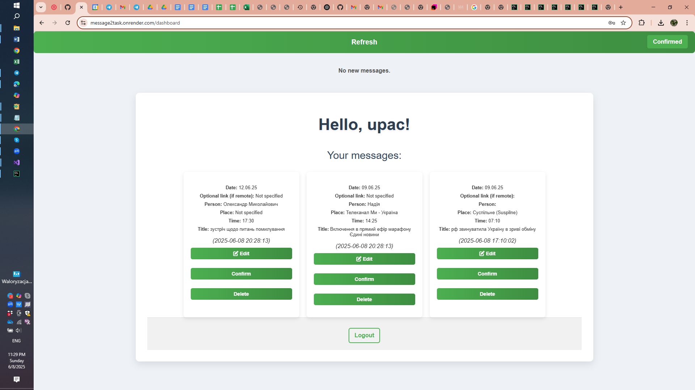
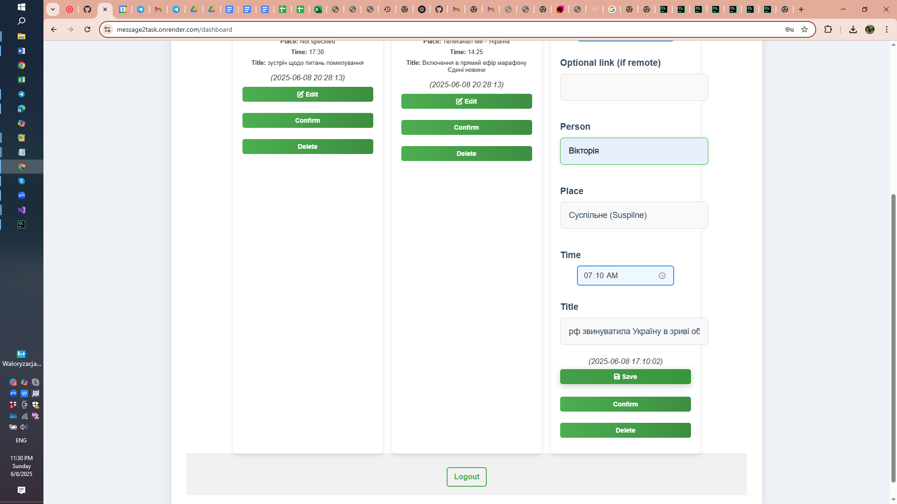
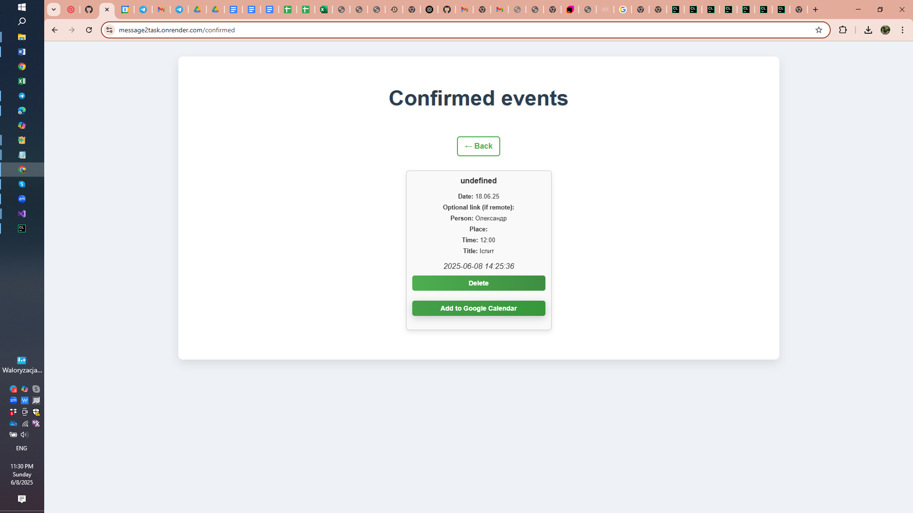

# Message2Task 🚀

**Turn messages into tasks — simple, fast, automatic.**

[👉 Try it online](https://message2task.onrender.com)

---

## 🔍 What is it?

**Message2Task** is a web application built with Flask (Python) that automatically extracts tasks from messages and allows you to manage them through an intuitive interface. You can edit, confirm, or delete tasks right in your browser.

---

## ⚙️ Features

* 📩 **Real-time message reception**
* 🤖 **AI-based message parsing** into formatted tasks powered by **Google Gemini API**
* ✅ One-click task confirmation
* ✏️ Edit task date, time, and details
* 🗑️ Delete unnecessary tasks
* 💾 Local saving of confirmed tasks (via LocalStorage)
* 🔄 Manual "Refresh" button
* 👀 "Confirmed" page to view saved tasks

---

## 🌐 Live Demo

[🔗 https://message2task.onrender.com](https://message2task.onrender.com)

---

📸 Screenshots

### Registration Form


### Dashboard View


### Edit Option on Dashboard


### Confirmation Screen



---

## 🛠️ Installation & Run

### 1. Clone the repository

```bash
git clone https://github.com/kate20031/Message2Task.git
cd Message2Task
```

### 2. Backend setup & run (Flask)

It is recommended to use a virtual environment:

```bash
python3 -m venv venv
source venv/bin/activate        # Windows: venv\Scripts\activate
pip install -r requirements.txt
```

Check the `.env` file and set environment variables as needed.

Run the Flask server:

```bash
python app.py
```

📍 By default, the server runs at: [http://localhost:5000](http://localhost:5000)

---

## 🧪 How to Use
1. Connect WhatsApp to Twilio Sandbox (Required step!):
Send a message from your WhatsApp device to +1 415 523 8886.
In the message, type: join dark-forgot.
This links your WhatsApp number to the Twilio Sandbox used by Message2Task.
2. Go to the main page of the app
3. Log in or register
4. On the Dashboard, you'll see messages converted into tasks
5. If needed — click **Edit** to modify (e.g., date or time)
6. After editing, click **Save**, then **Confirm**
7. To delete a task — click **Delete**
8. To view saved tasks, click **Confirmed**

---

## 🧹 Project Structure

```
Message2Task/
└── message2task/
    └── message2task/
        ├── app.py
        ├── __init__.py
        ├── extractor_context.py
        ├── ai_task_extractor.py
        ├── models.py
        ├── strategy_dummy.py
        ├── strategy_gemini.py
        ├── strategy_interface.py
        ├── .env
        ├── migrations/
        ├── templates/
        │   ├── confirmed.html
        │   ├── dashboard.html
        │   ├── home.html
        │   ├── login.html
        │   └── register.html
        ├── static/css/
        │   └── style.css
        ├── routes/
        │   ├── __init__.py
        │   ├── auth.py
        │   ├── dashboard.py
        │   ├── home.py
        │   └── messages.py
        ├── utils/
        │   ├── __init__.py
        │   ├── ai_task_helper.py
        │   ├── message_utils.py
        │   └── time_utils.py

```

---

## 🤠 Prerequisites

* Python 3.7+
* pip
* Git
* WhatsApp account (connected to Twilio Sandbox)
* Google Gemini API key (for AI-based message extraction)
---

## 🤝 Contribution

Pull Requests, Issues, and feedback are welcome!
Want to add a new feature or found a bug? — You’re welcome 👇

👉 [GitHub Issues](https://github.com/kate20031/Message2Task/issues)

---

## 📄 License

This project is licensed under the **Apache-2.0** license.
See the  [LICENSE](LICENSE) file for details.

---

💡 Made with ❤️ by [@kate20031](https://github.com/kate20031)
